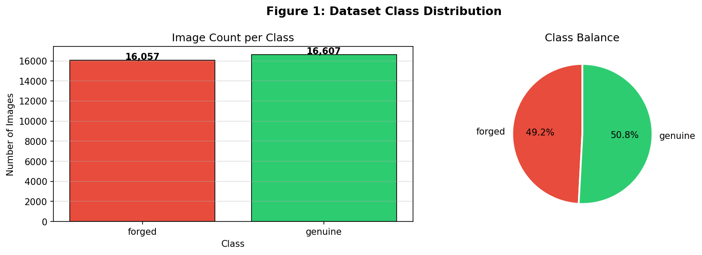
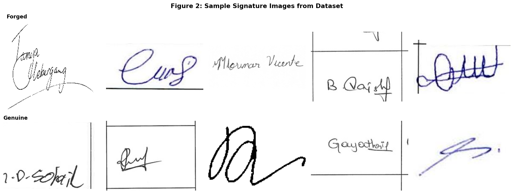
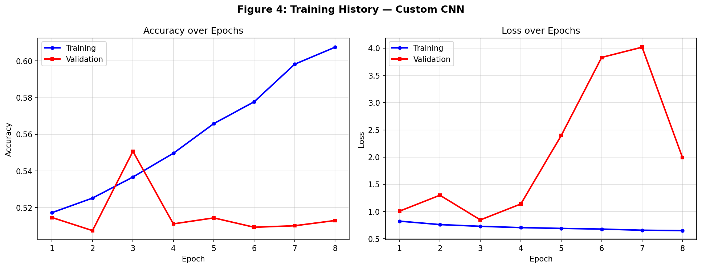
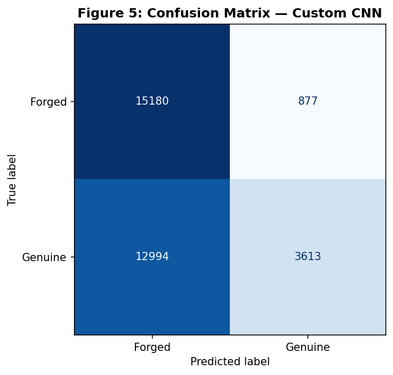
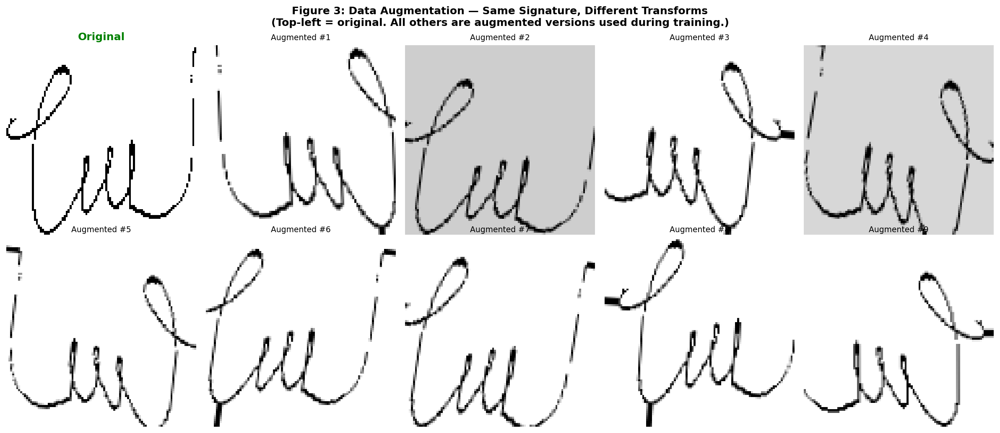

# Signature Fraud Detection — Deep Learning Classification of Genuine vs Forged Signatures

A deep learning project comparing three models for binary classification of handwritten signatures as **genuine** or **forged** — applied to financial fraud detection.

---

## Results

| Model | Accuracy | Precision | Recall | F1-Score |
|---|---|---|---|---|
| Custom CNN (baseline) | 52.76% | 0.5235 | 0.7894 | 0.6295 |
| **MobileNetV2 (transfer learning)** | **74.19%** | **0.7262** | **0.7906** | **0.7570** |
| ResNet-50 (transfer learning) | 62.56% | 0.6554 | 0.5558 | 0.6015 |

**MobileNetV2 outperformed the baseline by +21.43 percentage points.**  
ResNet-50 underperformed despite its depth — 23.9M parameters requires significantly more data than this dataset provides (~11 images per unique signer).


---

## Dataset

**Kaggle Signatures Dataset** — [manishvem/signatures-dataset](https://www.kaggle.com/datasets/manishvem/signatures-dataset)

- 32,664 images total: 16,332 genuine + 16,332 forged
- 1,487 unique signers
- Original size: 184×94px PNG → resized to 96×96px for training
- Split: 70% train / 15% validation / 15% test
- Perfectly balanced binary classification

The dataset stores each signer's images in individual folders (`0001/` = genuine, `0001_forg/` = forged). The notebook includes a restructuring script that reorganises this into `genuine/` and `forged/` folders as required by Keras `ImageDataGenerator`.



---

## Sample Images

Genuine signatures (top row) vs forged signatures (bottom row) from the dataset:



---

## Models

### Model 1 — Custom CNN (Baseline)
Built from scratch with no pretrained weights. Three convolutional blocks with increasing filter depth (32→64→128), batch normalisation, dropout regularisation, and a GlobalAveragePooling classifier head.

```
Input (96×96×3)
→ Conv Block 1: Conv(32) → BN → ReLU → MaxPool → Dropout(0.25)
→ Conv Block 2: Conv(64) → BN → ReLU → MaxPool → Dropout(0.25)
→ Conv Block 3: Conv(128)→ BN → ReLU → MaxPool → Dropout(0.25)
→ GlobalAveragePooling
→ Dense(256) → BN → Dropout(0.5)
→ Dense(64)  → Dropout(0.3)
→ Dense(1, sigmoid)
```

~339,361 parameters. Stopped at epoch 7 via EarlyStopping — failed to learn meaningful discriminative features without pretrained knowledge.





---

### Model 2 — MobileNetV2 (Transfer Learning) ✓ Best
Pretrained on ImageNet (1.2M images). Two-phase training:
- **Phase 1 (5 epochs):** base frozen, classifier head trained only
- **Phase 2 (up to 20 epochs):** top 30 layers unfrozen, fine-tuned at LR/10 (1e-5)

2.4M parameters. Inverted residual blocks with linear bottlenecks. The ImageNet feature representations generalised well to signature stroke patterns — edges, curves, spatial relationships — which is why transfer learning succeeded where the baseline failed.


---

### Model 3 — ResNet-50 (Transfer Learning)
Same two-phase strategy as MobileNetV2. 23.9M parameters with residual skip connections (`output = F(x) + x`) to prevent vanishing gradients.

Underperformed relative to MobileNetV2 — the architecture is designed for large-scale datasets. With only ~11 images per signer at 96×96 resolution, the model capacity exceeded what the data could meaningfully fill.


---

## Model Comparison

Validation accuracy across all epochs for all three models:


---

## Training Configuration

| Setting | Value |
|---|---|
| Image size | 96×96px (reduced from 224×224 for GPU efficiency) |
| Batch size | 64 |
| Optimiser | Adam |
| Phase 1 LR | 1e-4 |
| Phase 2 LR | 1e-5 |
| Loss | Binary Cross-Entropy |
| Max epochs | 20 |
| Early stopping patience | 5 (monitors val_accuracy) |
| LR reduction | factor=0.5, patience=3 |
| Platform | Kaggle (Tesla P100 GPU) |

---

## Data Augmentation

Augmentation is applied to the **training set only**. Validation and test sets are rescaled only — to ensure honest performance measurement.

| Technique | Setting | Rationale |
|---|---|---|
| Horizontal flip | True | Simulates variation in writing direction |
| Rotation | ±10° | Signatures are rarely perfectly level |
| Zoom | ±10% | Handles size variation across documents |
| Width/height shift | 10% | Centres vary by document placement |
| Shear | 5% | Mimics slight pen angle differences |
| Brightness | [0.8–1.2] | Handles pen pressure and scan quality variation |



---

## Key Findings

**Transfer learning is essential when per-signer samples are limited.** MobileNetV2's pretrained feature representations — originally learned from 1.2M diverse images — generalised effectively to signature stroke patterns, despite the domain difference. The custom CNN had no such prior knowledge to build on.

**Model capacity must match dataset size.** ResNet-50's 23.9M parameters were not beneficial here. More parameters require more data to tune meaningfully. MobileNetV2's lightweight architecture (2.4M parameters, designed for efficiency) was a better fit for this dataset scale.

**Resolution is a genuine trade-off.** 224×224 training took approximately 477 seconds per epoch on a P100 GPU — impractical for iterative experimentation. Reducing to 96×96 brought this to a manageable range. The resolution reduction loses some fine-grained stroke detail, and this is a real limitation worth acknowledging.

---

## How to Run

1. Open the notebook on Kaggle
2. Attach the [Signatures Dataset](https://www.kaggle.com/datasets/manishvem/signatures-dataset)
3. Settings → Accelerator → **GPU P100**
4. Run All

All dependencies (TensorFlow, scikit-learn, PIL, matplotlib, seaborn) are pre-installed in the Kaggle environment. All figures are saved automatically to `/kaggle/working/` and available in the Output tab after training.

---

## Limitations and Future Work

- **Binary approach:** The model classifies genuine vs forged globally. Real-world deployment would need per-signer verification — comparing a new signature against known genuine examples from the same person. This is a different and harder problem, typically addressed with Siamese networks.
- **Resolution:** 96×96px captures overall structure but loses fine-grained stroke details that a higher-resolution model could exploit.
- **Dataset scale:** ~11 genuine images per unique signer is low for a strongly generalising classifier. Larger per-signer datasets would benefit deeper architectures like ResNet.
- **Future directions:** Siamese networks for one-shot verification, Vision Transformers (ViT), GAN-based augmentation for rare signer classes, EfficientNetB0 as a lighter ResNet alternative.

---

## Tech Stack

Python · TensorFlow/Keras · scikit-learn · NumPy · Pandas · Matplotlib · Seaborn · Pillow · Kaggle (Tesla P100 GPU)

---

## About

This project is part of a broader exploration of AI-powered fraud detection in financial services — combining computer vision research with practical banking and compliance applications.

See also: [VisGuard AI](https://github.com/lordhynet/visguard-ai) — an AI-powered visual fraud detection system for banking documents, building on the methods explored here.

**Author:** Surakat Gideon  
MSc Data Science & AI — University of East London  
Software Engineer — Fintech & Digital Banking  
[Medium](https://medium.com/@surakatgideon) · [LinkedIn](https://linkedin.com/in/gideon-surakat)
